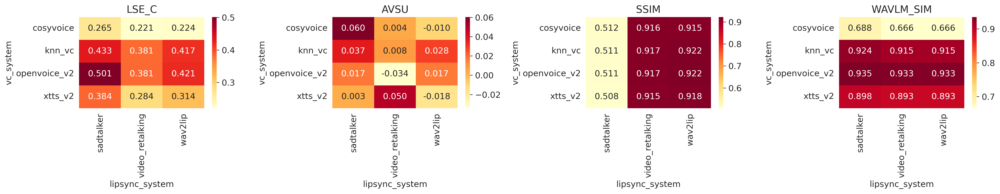
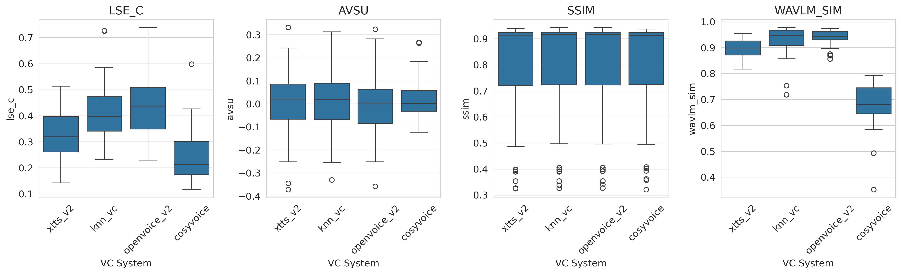
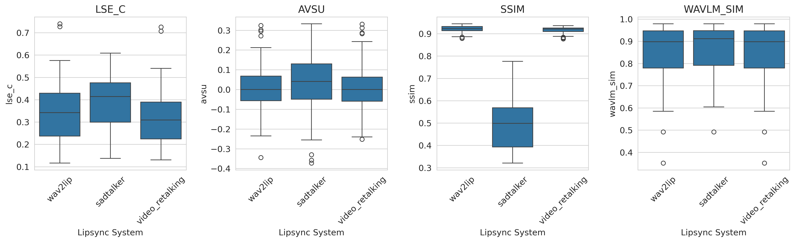
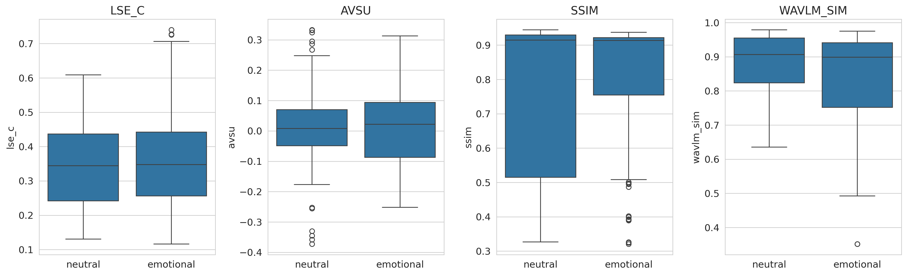

<!-- _class: lead -->

# A Factorial Benchmark of Voice Cloning and Lip Synchronization Pipelines

## for Spanish-Language Talking Head Generation

**Author Names** | Institution
Conference Name, 2026

---

<!-- _class: divider -->

# THE GAP

Why we need factorial benchmarks

---

# Motivation

Talking head generation combines two AI components:

### Voice Cloning (VC)
Generate speech in a target speaker's voice

- XTTS-v2, kNN-VC, OpenVoice, CosyVoice...
- Evaluated in isolation (ClonEval, RVCBench)

### Lip Synchronization
Animate face to match audio

- Wav2Lip, SadTalker, VideoReTalking...
- Evaluated in isolation (THEval: 17 models)

> **The problem:** No benchmark evaluates them *together* in a factorial design.
> Practitioners must combine components but have no evidence about interactions.

---

# What Exists vs. What's Missing

| Benchmark | VC | Lipsync | **Factorial?** | Purpose |
|-----------|:--:|:-------:|:--------------:|---------|
| THEval (2025) | 0 | 17 | No | Lipsync quality |
| ClonEval (2025) | 5 | 0 | No | VC quality |
| RVCBench (2026) | 11 | 0 | No | VC robustness |
| AV-Deepfake1M++ (2025) | 5 | 3 | **Yes** | Deepfake *detection* |
| **This work** | **4** | **3** | **Yes** | **Quality assessment** |

**First factorial VC × Lipsync quality benchmark on same stimuli**

---

# Research Questions

### Hypotheses

**H1** VC system affects audio quality
**H2** Lipsync system affects visual quality
**H3** VC × Lipsync interaction exists
**H4** Emotion degrades quality
**H5** Emotion × Tool interaction
**H6** Metrics correlate with human ratings

### Design

$4 \text{ VC} \times 3 \text{ Lipsync} \times 2 \text{ Emotions}$

- 5 Spanish-speaking actors
- 2 clips per condition (5s each)
- 10 computational metrics
- PLACEHOLDER Human eval (N=30)

---

<!-- _class: divider -->

# METHOD

4 VC × 3 Lipsync × 2 Emotions × 5 Actors

---

# Source Material

### 5 Actors, 2 Conditions

| Actor | Gender | Neutral condition | Emotional condition |
|-------|--------|-------------------|---------------------|
| **George** | M | Reading instructions | Dramatic monologue |
| **Jordi** | M | Reading instructions | Dramatic monologue |
| **Lisset** | F | Reading instructions | Dramatic monologue |
| **Maisa** | F | Reading instructions | Dramatic monologue |
| **Selene** | F | Reading instructions | Dramatic monologue |

### Processing Pipeline
1. **Extract** 2 clips × 5s from each ~60s video → **20 source clips**
2. **Face crop** to 512×512 via MediaPipe (two-pass: detect → smooth 7-frame → crop 1.5× padding)
3. **Extract audio** at 16 kHz mono | **Language:** Spanish

---

# Voice Cloning Systems

| System | Approach | Input | Language | Output |
|--------|----------|-------|----------|--------|
| **XTTS-v2** | Text re-synthesis | Whisper ASR → TTS | Spanish (explicit) | Multi-rate |
| **kNN-VC** | kNN feature matching | Audio → audio | Agnostic | 16 kHz |
| **OpenVoice V2** | Tone color transfer | Audio → audio | Agnostic | Multi-rate |
| **CosyVoice 2** | Zero-shot TTS | Whisper ASR → TTS | Spanish (native) | 22 kHz |

- **Text-based** (XTTS-v2, CosyVoice): transcribe source → re-synthesize with reference voice
- **Audio-based** (kNN-VC, OpenVoice): directly convert voice timbre

**Result:** 20 clips × 4 VC = **80 VC outputs** (100% success)

---

# Lip Synchronization Systems

| System | Input type | Method |
|--------|-----------|--------|
| **Wav2Lip** | Video + audio | Modify mouth region of input frames |
| **SadTalker** | Still image + audio | Generate from 3D motion coefficients |
| **VideoReTalking** | Video + audio | DNet + LNet + ENet pipeline |
| ~~MuseTalk~~ | ~~Video + audio~~ | *Disabled: mmpose ↔ Python 3.13* |

**Result:** 80 VC × 3 lipsync = 240 planned → **232 generated** (96.7%)
- 8 failures: SadTalker face detection errors

All outputs standardized: **512×512, 25 fps, H.264**

---

# Evaluation Metrics (10)

### Synchronization (5)
| Metric | Measures |
|--------|----------|
| **LSE-C** | Sync confidence (SyncNet proxy) |
| **LSE-D** | Sync distance (SyncNet proxy) |
| **AVSu** | AV sync, utterance (AV-HuBERT proxy) |
| **AVSm** | AV sync, matched vs GT |
| **LMD** | Lip landmark distance vs GT |

### Visual (2) + Audio (3)
| Metric | Measures |
|--------|----------|
| **SSIM** | Structural similarity vs GT |
| **CPBD** | Sharpness (Laplacian variance) |
| **WavLM sim** | Speaker embedding similarity |
| **Mel sim** | Spectral similarity |
| **WER** | Word error rate (Whisper) |

**Statistical test:** One-way ANOVA per metric × factor, BH FDR at $\alpha = 0.05$

---

<!-- _class: divider -->

# RESULTS

232 videos, 10 metrics, 30 ANOVA tests

---

# The Big Picture: Clean Factorization

VC system controls **audio** quality &nbsp;&nbsp;|&nbsp;&nbsp; Lipsync system controls **visual** quality &nbsp;&nbsp;|&nbsp;&nbsp; Emotion = **no effect**

| Factor | Significant effects | Metrics affected | $\eta^2$ range |
|--------|:-------------------:|-----------------|:-------------:|
| **VC system** | 5 / 10 | WavLM, Mel, WER, LSE-C, LSE-D | 0.20 – **0.73** |
| **Lipsync system** | 6 / 10 | SSIM, LMD, CPBD, LSE-C, LSE-D, AVSm | 0.04 – **0.85** |
| **Emotion** | 0 / 10 | None | < 0.01 |

**11 out of 30** tests significant after FDR correction
All in expected directions: VC → audio, Lipsync → visual

---

# H1: VC System Dominates Audio Metrics

| Metric | $F$ | $p$ | $\eta^2$ |
|--------|----:|----:|--------:|
| **WavLM sim** | 204.98 | <.001 | **.730** |
| **Mel sim** | 57.69 | <.001 | **.432** |
| **LSE-C** | 42.44 | <.001 | .358 |
| **LSE-D** | 41.93 | <.001 | .356 |
| **WER** | 17.58 | <.001 | .196 |

VC explains **43–73%** of variance
in audio quality metrics

### Speaker Similarity by VC
| System | WavLM sim |
|--------|----------:|
| **OpenVoice V2** | **0.934** |
| kNN-VC | 0.918 |
| XTTS-v2 | 0.895 |
| CosyVoice 2 | 0.673 |

OpenVoice V2 (audio-to-audio) preserves speaker identity best

---

# H2: Lipsync System Dominates Visual Metrics

### ANOVA Results

| Metric | $F$ | $p$ | $\eta^2$ |
|--------|----:|----:|--------:|
| **SSIM** | 623.44 | <.001 | **.845** |
| **LMD** | 282.64 | <.001 | **.712** |
| **CPBD** | 18.38 | <.001 | .138 |

Lipsync explains **71–85%** of variance
in visual quality metrics

### Visual Quality by Lipsync System

| System | SSIM | LMD ↓ | CPBD |
|--------|-----:|------:|-----:|
| **Wav2Lip** | **0.920** | **4.65** | 91.8 |
| **VideoReTalking** | 0.916 | 8.46 | 109.7 |
| SadTalker | 0.510 | 30.87 | 66.9 |

Wav2Lip & VideoReTalking preserve visual structure; SadTalker (image-based) diverges

---

# H4: Emotion Has No Effect

Emotion condition (neutral vs. emotional) had **no significant effect** on any of the 10 metrics

| Metric | $F$ | $p$ | $\eta^2$ | Significant? |
|--------|----:|----:|--------:|:------------:|
| WavLM | 3.29 | .071 | .014 | No |
| LMD | 2.87 | .092 | .012 | No |
| LSE-D | 2.33 | .129 | .010 | No |
| Mel sim | 1.19 | .276 | .005 | No |
| LSE-C | 1.19 | .276 | .005 | No |
| SSIM | 0.69 | .407 | .003 | No |
| AVSm | 0.55 | .460 | .002 | No |
| WER | 0.15 | .700 | .001 | No |
| AVSu | 0.03 | .852 | <.001 | No |
| CPBD | 0.03 | .853 | <.001 | No |

---

# H4: Why No Emotion Effect?

All 10 metrics: $p > .05$, max $\eta^2 = 0.014$ (WavLM)

**Three possibilities:**

1. **Dramatic monologue ≠ discrete emotions** — unlike ClonEval's categorical emotions (happy, sad, angry), our stimuli use continuous emotional speech
2. **Five-second clips too short** — emotion effects may need longer durations to accumulate measurable degradation
3. **Computational metrics insensitive** — metrics may be genuinely blind to emotion quality; human evaluation needed

> This makes **H6** (metric validity via human correlation) especially important as a next step.

---

# Heatmaps: VC × Lipsync Interaction

Rows = VC systems, Columns = Lipsync systems. Audio metrics vary by row (VC), visual metrics vary by column (Lipsync).

---

# VC System Comparison

---

# Lipsync System Comparison

---

# Emotion Comparison

---

<!-- _class: divider -->

# DISCUSSION

What this means for practitioners

---

# Key Takeaways

### Independence

VC and lipsync affect **non-overlapping** metric domains:
- VC → audio ($\eta^2$ = 0.20–0.73)
- Lipsync → visual ($\eta^2$ = 0.14–0.85)
- Cross-domain: $\eta^2$ < 0.001

**Practical implication:**
Select each component independently based on domain-specific needs

### Metric Insights

- **LSE-C/D** primarily reflect audio, not visual sync
  - Consistent with Zhang et al. (ICIP 2024)
  - SyncNet bias documented by Yaman et al. (ECCV 2024)
- **AVSu** showed no sensitivity to any factor
- **SSIM** is the most discriminative visual metric ($\eta^2$ = 0.85)

---

# Comparison with Literature

| Finding | Prior work | Our result |
|---------|-----------|------------|
| LSE-C/D correlate with sync quality | Zhang (ICIP '24): **poor correlation** | Confirmed: LSE-C/D track VC choice, not lipsync |
| SyncNet biased toward neutral | Yaman (ECCV '24): yes | No emotion effect at all in our metrics |
| Emotional speech degrades VC | ClonEval: partial degradation | **No effect** in our 5s clips |
| Combined pipeline = interaction | AV-Deepfake1M++: implied | **Largely additive** at metric level |

> The factorial design reveals what component-level benchmarks cannot: **independence, not interaction, is the dominant pattern.**

---

# Limitations & Future Work

### Limitations

- **Small pool:** 5 actors, Spanish only
- **MuseTalk disabled** (Python 3.13 / mmpose)
- **8 SadTalker failures** (non-random)
- **High WER** across all systems (mean 1.12)
- **Proxy metrics**, not full SyncNet/AV-HuBERT
- **No human evaluation** yet

### Next Steps

- PLACEHOLDER **Human evaluation** (N=30, 4 MOS dimensions)
  - Design ready, Flask app built
- Include MuseTalk when mmpose updated
- Test additional languages
- Longer clips (>5s)
- Full metric implementations
- VC × Lipsync interaction in human perception

---

# Human Evaluation Design PLANNED

### Protocol

- **N = 30** participants
- 2 identities per participant
- 32 conditions each (4 VC × 4 LS × 2 emo)
- **64 ratings** per participant

### 4 MOS Dimensions (1–5)
1. Overall quality
2. Lip synchronization
3. Voice naturalness
4. Visual naturalness

### Statistical Analysis

**LMM:**
$$\text{MOS} \sim \text{VC} \times \text{LS} \times \text{Emo} + (1|\text{part.}) + (1|\text{id})$$

**H6: Metric validity**
Spearman $\rho$ between computational metrics and human MOS
- Bootstrap 95% CI (10k iterations)
- Compare with THEval's $\rho = 0.870$

---

# H1–H3: Human Ratings by System PLACEHOLDER

### MOS by VC System (H1)
| VC System | Overall | Lip sync | Voice nat. | Visual nat. |
|-----------|:-------:|:--------:|:----------:|:-----------:|
| XTTS-v2 | — | — | — | — |
| kNN-VC | — | — | — | — |
| OpenVoice V2 | — | — | — | — |
| CosyVoice 2 | — | — | — | — |

### MOS by Lipsync System (H2)
| Lipsync | Overall | Lip sync | Voice nat. | Visual nat. |
|---------|:-------:|:--------:|:----------:|:-----------:|
| Wav2Lip | — | — | — | — |
| SadTalker | — | — | — | — |
| VideoReTalking | — | — | — | — |

### LMM Results (H1–H3)
| Effect | MOS dim. | $F$ | $p$ | $\eta^2_p$ |
|--------|----------|----:|----:|-----------:|
| VC (H1) | Overall | — | — | — |
| VC (H1) | Voice nat. | — | — | — |
| LS (H2) | Overall | — | — | — |
| LS (H2) | Lip sync | — | — | — |
| VC×LS (H3) | Overall | — | — | — |
| VC×LS (H3) | Lip sync | — | — | — |

> *Fill with LMM output after running `05_run_analysis.py` on human data*

---

# H4–H5: Emotion in Human Perception PLACEHOLDER

### MOS by Emotion (H4)
| Condition | Overall | Lip sync | Voice nat. | Visual nat. |
|-----------|:-------:|:--------:|:----------:|:-----------:|
| Neutral | — | — | — | — |
| Emotional | — | — | — | — |
| **Difference** | — | — | — | — |

### LMM: Emotion Effects
| Effect | MOS dim. | $F$ | $p$ | $\eta^2_p$ |
|--------|----------|----:|----:|-----------:|
| Emotion (H4) | Overall | — | — | — |
| Emo×VC (H5) | Overall | — | — | — |
| Emo×LS (H5) | Lip sync | — | — | — |

### Key Question

Do human judges detect emotion effects that **computational metrics missed**?

- Computational: 0/10 metrics significant for emotion
- Human: PLACEHOLDER — / 4 MOS dimensions significant

> *If humans detect differences that metrics don't → strong case for human evaluation in talking head benchmarks*

---

# H6: Metric Validity PLACEHOLDER

### Spearman $\rho$ : Computational Metrics vs. Human MOS

| Metric | vs. Overall | vs. Lip sync | vs. Voice nat. | vs. Visual nat. |
|--------|:----------:|:------------:|:--------------:|:---------------:|
| LSE-C | — | — | — | — |
| LSE-D | — | — | — | — |
| SSIM | — | — | — | — |
| LMD | — | — | — | — |
| CPBD | — | — | — | — |
| WavLM sim | — | — | — | — |
| Mel sim | — | — | — | — |
| WER | — | — | — | — |

> Bootstrap 95% CI (10k iterations). Compare with THEval's best: $\rho = 0.870$

*[Insert scatter plot: best metric vs. human MOS — `figures/fig_metric_validity.png`]*

---

<!-- _class: lead -->

# Thank You

## A Factorial Benchmark of Voice Cloning and Lip Synchronization Pipelines

 

**4 VC** × **3 Lipsync** × **2 Emotions** × **5 Actors** = **232 stimulus videos**

VC controls audio ($\eta^2$ = 0.73) &nbsp;|&nbsp; Lipsync controls visual ($\eta^2$ = 0.85) &nbsp;|&nbsp; Emotion = no effect

 

Code & data: PLACEHOLDER GitHub / OSF
Contact: author@institution.edu
